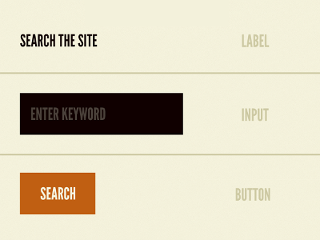
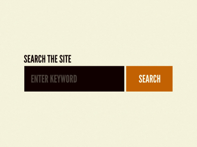

##### Unoesc Chapecó
##### Pós-Graduação em Desenvolvimento Web, Cloud e Dispositivos Móveis - WebMob
##### Disciplina: Desenvolvimento com HTML5 e CSS3
##### Professor: Jean Carlo Nascimento
##### Acadêmico: Charles Busatta Cunico {charlesbc@unochapeco.edu.br}
## Artigo de revisão de Atomic Design

####Resumo:
Atomic Design é uma metodologia criada por Brad Frost, que se utiliza de analogias científicas para idealizar o desenvolvimento de sistemas de design de interface. O objetivo é simplificar e reduzir o tempo de desenvolvimento por meio da reutilização de estruturas padronizadas. Esta padronização é formada, em Atomic Design, por estruturas que são comparadas aos átomos, moléculas, organismos, templates e páginas.


####1. O que é?
De acordo com o autor Brad Frost, Atomic Design é uma metodologia composta por cinco estágios distintos, que trabalhados em conjunto produzem sistemas de design de interface. Os cinco estágios de Atomic são:</br>

1)  Átomos<br>
2)  Moléculas<br>
3)  Organismos<br>
4)  Templates<br>
5)  Páginas

Semelhante ao que presenciamos na natureza, os sistemas podem ser subdivididos utilizando uma classificação semelhante à estudada pela química elementar. Partindo da unidade mais básica, o átomo, que nesta metodologia é representado pelas tags HTML, são agrupados de determinadas maneiras a fim de formar sistemas complexos.


####2. Como funciona
#####2.1. Átomos:
Representam os blocos fundamentais da interface, que podem ser tags básicas do HTML como inputs, buttons, labels e demais elementos considerados indivisíveis, por não poderem ser quebrados em mais elementos sem que perca sua funcionalidade. Também podemos incluir na classificação de átomos, elementos mais abstratos como animações, fontes, paleta de cores, etc.

Cada átomo possuirá propriedades únicas, tais como as dimensões de uma imagem de logotipo ou o tamanho da fonte de um título. A definição dessas propriedades elementais é que irão promover a consistência e coesão da interface.

#####2.2. Moléculas:
Uma molécula é o simples grupo de componentes isolados (átomos) funcionando para atender um propósito único. Como exemplo, uma label, um input e um button, individualmente não possuem muita utilidade, porém quando combinados podem resultar em uma molécula de formulário de busca. Esta molécula possui unicamente a funcionalidade de efetuar buscas, e pode ser aplicada em qualquer parte do sistema que a necessitar. Trata-se de um componente simples, funcional e reutilizável.

#####2.3. Organismos:
Da mesma forma que uma molécula é composta pelo agrupamento de átomos, um organismo é composto pelo agrupamento de moléculas. Também pode conter átomos individuais em sua composição. São componentes relativamente complexos e formam as seções da interface, como sidebar, header, footer, etc.

Mas diferente do comportamento de uma molécula, que possui apenas um propósito, um organismo pode possuir vários propósitos funcionando paralelamente. Como por exemplo um header pode conter um logotipo, um menu principal e um campo de busca.

A construção de organismos nos ajuda a manter componentes autônomos, portáteis e reutilizáveis.

#####2.4. Templates:
Templates são agrupamentos de organismos que juntos combinam na formação de objetos a nível de página. Seu principal foco é a estrutura do conteúdo, como dimensões de imagem, tamanhos de fontes entre outros, e não o conteúdo final da página.

A importância dos templates está em demonstrar o visual e o funcionamento dos componentes dentro de uma estrutura de layout, e proporcionando contexto aos antes abstratos organismos e moléculas.

#####2.5. Páginas:
Página é a evolução da etapa template, onde os componentes são preenchidos com conteúdo representativo, tipografia e cores, formando assim um design de alta fidelidade. É o estágio mais concreto do Atomic Design, onde todos os componentes se juntam para formar a interface do usuário.

As páginas são essenciais para validar a efetividade do sistema de design. Com esta forma final é possível revisar moléculas, organismos e templates para que sejam ajustados afim de melhor atender as necessidades do conteúdo.

####3. Para que usar
Atomic Design é utilizado para manter uma organização da interface, permitindo trabalhar de forma modular.  É ideal para sistemas com layout responsivo, criando desde o início os componentes com essa característica.

O agrupamento dos elementos montando guias de estilo proporciona maior agilidade ao projeto, permitindo facilmente visualizar o layout utilizando os componentes criados.


####4. Onde usar?
O uso de Atomic Design não é aconselhado para páginas e hot-sites. Seu potencial é melhor explorado quando aplicado em sistemas, possibilitando a criação de uma interface para um layout mais sólido e modular.

Também apresenta grandes vantagens para ser utilizado em sistemas complexos, desenvolvendo componentes reutilizáveis e facilitando o padrão visual e a manutenção do código.


####5. Exemplos:
#####5.1 Átomos
Representado por tags básicas HTML

Código HTML de um átomo input :
```html
<input type="text" class="atom-input" name="name" />
```
CSS do átomo input:
```css
.atom-input {
  width: 300px;
}
@media (max-width: 600px) {
  .atom-input {
    width: 100%; 
  }
}
@media (min-width: 1200px) {
  .atom-input {
    width: 400px; 
  }
}
```

#####5.2. Moléculas:

Código HTML de uma molécula form:
```html
<form class="molecule-form" actiton="/beers">
  <div class="field-container">
    <label class="atom-label">Name:</label>
    <input type="text" class="atom-input" name="name" />
  </div>
  <div class="field-container">
    <label class="atom-label">Category:</label>
    <input type="text" class="atom-input" name="category" />
  </div>
  <div class="field-container">
    <label class="atom-label">Alcohol:</label>
    <input type="number" class="atom-input" step="0.1" min="0" name="alcohol" />
  </div>
  <div class="field-container">
    <label class="atom-label">Description:</label>
    <textarea class="atom-textarea" name="description"></textarea>
  </div>
  <div class="button-container">
    <button class="atom-button button-save">Salvar</button>
    <button class="atom-button button-remove">Remover</button>
  </div>
</form>
```
CSS da molécula form:
```css
.molecule-form {
  width: 610px;
  margin: 0 auto;
}

@media (max-width: 600px) {
  .molecule-form {
    width: 100%;
    display: block;
  }
}

@media (min-width: 1200px) {
  .molecule-form {
    width: 50%;
  }
}
```

#####5.3. Organismos:
Exemplo de um organismo header:


#####5.4. Templates:
Exemplo de um template para uma home:


#####5.5. Páginas:
Exemplo de página com alguns conteúdos preenchidos:


####6. Referências
[http://nomadev.com.br/atomic-design-por-que-usar/](http://nomadev.com.br/atomic-design-por-que-usar/)<br>
[http://nomadev.com.br/atomic-design-com-angularjs/](http://nomadev.com.br/atomic-design-com-angularjs/)<br>
[http://atomicdesign.bradfrost.com/](http://atomicdesign.bradfrost.com/)<br>
[http://patternlab.io/about.html](http://patternlab.io/about.html)<br>
[http://pt.slideshare.net/bradfrostweb/atomic-design/](http://pt.slideshare.net/bradfrostweb/atomic-design/)<br>
[http://tableless.com.br/o-que-e-design-atomic/](http://tableless.com.br/o-que-e-design-atomic/)<br>
